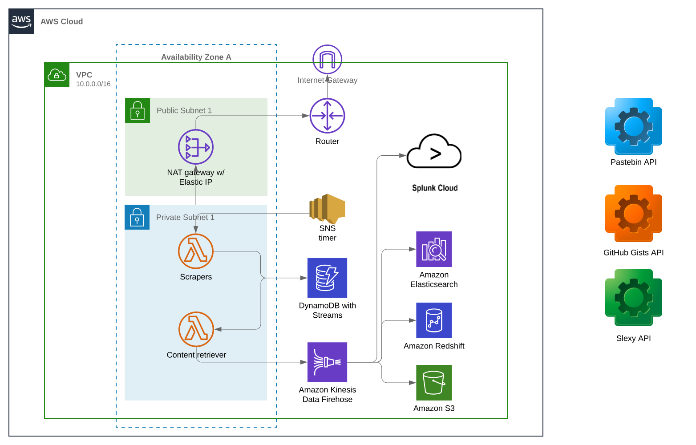

# PasteHunter serverless

PasteHunter serverless is an AWS serverless wrapper for @kevthehermit's [PasteHunter project](https://github.com/kevthehermit/PasteHunter) and is a means of running some or all of those paste source scrapers without any continuous running compute resources.

Each of the 'input' paste sources each have an [AWS Lambda](https://aws.amazon.com/lambda/) that is scheduled independently to get the latest list of paste content using the respective API. 

The paste item metadata, including content URL, are then queued and retrieved by a separate Lambda function. Once the content is retrieved, it is transformed and published to a stream using [Amazon Kinesis Firehose](https://aws.amazon.com/kinesis/data-firehose/) which allows for direct push to any of the following platforms for further analysis without any coding:
* [AWS S3](https://aws.amazon.com/s3/)
* [Elasticsearch](https://aws.amazon.com/elasticsearch-service/)
* [AWS Redshift](https://aws.amazon.com/redshift/)
* [Splunk](https://www.splunk.com/)

## Getting Started

The basic setup for running the platform within AWS is as follows.



The environment can be setup based on the AWS CDK script included under the `./aws/` folder using the AWS CDK CLI tool, `cdk <command>`.

### Environment Setup

Create and activate a Python3 virtual environment.

```
$ python3 -m venv .env
$ source .env/bin/activate
$ pip install -r requirements.txt
```

Using Anaconda:

```
$ conda create -n pastehunter python=3.7
$ conda activate pastehunter
$ pip install -r requirements
```

If this is the first time you have run the CDK in your AWS account, you need to bootstrap the environment first, which at present just means creating an S3 bucket for use by the CDK framework.

```
$ cdk bootstrap
 ⏳  Bootstrapping environment aws://999999999999/us-east-1...
CDKToolkit: creating CloudFormation changeset...
 0/2 | 7:13:20 PM | CREATE_IN_PROGRESS   | AWS::S3::Bucket | StagingBucket
 0/2 | 7:13:20 PM | CREATE_IN_PROGRESS   | AWS::S3::Bucket | StagingBucket Resource creation Initiated
 1/2 | 7:13:42 PM | CREATE_COMPLETE      | AWS::S3::Bucket | StagingBucket
 2/2 | 7:13:44 PM | CREATE_COMPLETE      | AWS::CloudFormation::Stack | CDKToolkit
 ✅  Environment aws://999999999999/us-east-1 bootstrapped.
```

Once the CDK bootstrap process completes, you can now deploy the PasteHunter serverless environment setup and code deployment.

```
$ cdk deploy
```

The CDK will create a VPC, 2 public and 2 private subnets in 2 distinct availability zones. 

**Note**: In the interest of limiting the expenditure on the 1 continuously running resource, an AWS NAT Gateway which proxies internet bound requests from the Lambda, there is only 1 egress point for both private subnets via the single NAT Gateway instance. If you prefer to change this and have 2 independent NAT Gateway egress points, one for each Availability Zone, change the `nat_gateways=' value app.py to have value '2'.

```
    # only add 1 NATGW for cost savings
    # remove the parameter or set explicitly for HA across 2 AZs
    vpc = ec2.Vpc(self, "VPC", nat_gateways=1)
```

To learn more about the AWS CDK, see the [AWS CDK Developer Guide](https://docs.aws.amazon.com/cdk/latest/guide/home.html).

## Scraping Details by Site

### Pastebin.com

One of the first requirements to be aware of for retrieving content in bulk from Pastebin.com is that bulk scraping/content retrieval is only allowed for Pastebin Pro users. And, use of the Pastebin Pro tier requires that the IP address from which the request will originate be whitelisted with your Pastebin Pro account.

For that reason, the AWS solutions requires that the AWS Lambda functions are configured to connect through a Virtual Private Cloud (VPC) and egress via a fixed IP address in the form of an Elastic IP (EIP). 

See Pastebin.com (scraping documentation)[https://pastebin.com/doc_scraping_api] for more details and for setting/updating the IP from which your scraping requests will originate.

### GitHub gists

*TODO*

## License

This project is licensed under the terms of the Apache 2.0 license.